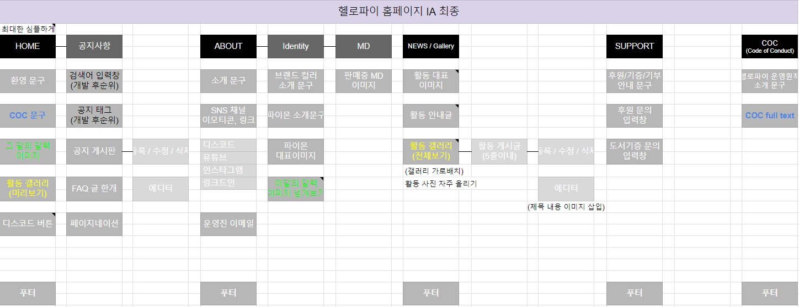

# 2025/01/19 ProjectManager DevLog
## 업무 내용
- 2025/01/13 21:00 기능-디자인 회의 (+백엔드)
- IA 작성
- HelloPY 활동 대표이미지 생성

## IA 작성 (담당 : 주영)
기능-디자인 회의 내용 바탕으로 개발자 요구사항을 반영하여 IA를 직관적으로 수정하였습니다. 

푸터, 공지사항 등을 추가했고, 홈화면이 너무 무겁지 않게 IA를 수정하였습니다.

## HelloPY 활동 대표이미지 생성 (담당 : 대현)
HelloPY의 NEWS / Gallery 페이지에 들어갈 대표이미지를 생성하기 위한 코드를 작성하였습니다.

HelloPY 홈페이지 스타일이 나오면, 반영해서 수정하면 될 것 같습니다.

아니면, text2image로 이미지 생성하는 방법도 있습니다. 
> https://colab.research.google.com/drive/16w4IuHRsS_5EWDd8-i0l8KM40znpBUkq?usp=sharing

## 앞으로 해야할 업무
- 활동 안내글 작성 (~01/28 마감)
- 기획팀 일정 관리 시작(깃헙 프로젝트 사용)

## 특이사항

## 회고

## 참고자료

