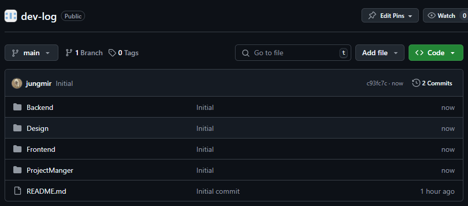
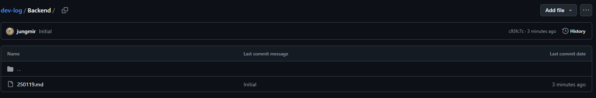
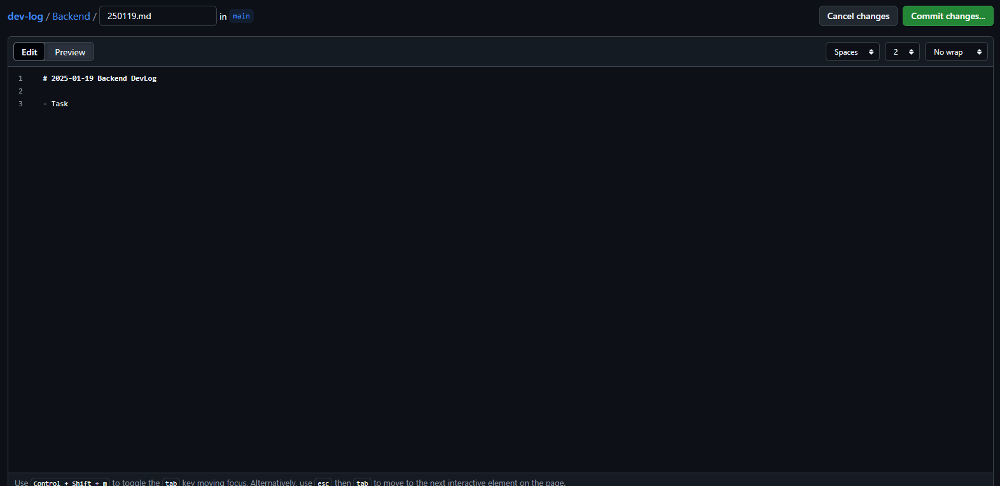
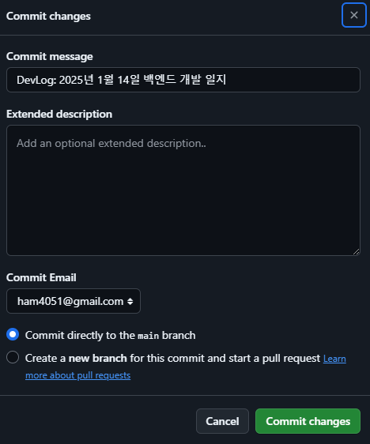

# dev-log
HelloPy 개발 일지

## Guide

### DevLog 작성하기

1. [DevLog](https://github.com/HelloPy-Korea/dev-log) 코드 저장소에 접속한다.
2. 개발 일지를 작성할 팀을 선택한다.
- 
3. 개발 일지를 추가한다.
- 
4. 파일 이름을 "년월일.md"로 설정한다.
5. 개발 일지를 작성한다.
- 
6. 우측 상단의 "Commit changes..." 버튼을 눌러 Commit을 준비한다.
7. Commit Message에 다음과 같은 형식으로 Message를 작성한다.
> DevLog: 년-월-일 팀 개발 일지
- 
8. 우측 하단의 Commit changes를 눌러 수정 사항을 반영한다.